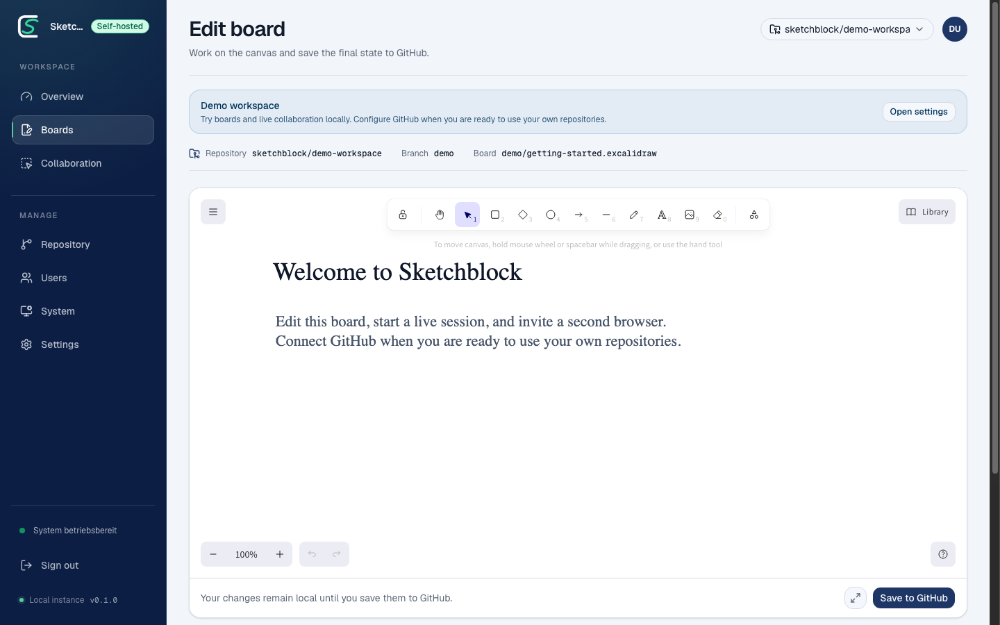

# Sketchblock

<p align="center">
  
</p>

<p align="center">
  <a href="https://github.com/mimeonline/sketchblock/actions/workflows/ci.yml"></a>
  <a href="https://github.com/mimeonline/sketchblock/releases"></a>
  <a href="LICENSE"></a>
  <a href="https://mimeonline.github.io/sketchblock/"></a>
</p>

An Excalidraw diagram stored in Git usually takes a manual round trip before it can be updated: download the file, open it in Excalidraw, edit it, export it again, replace the repository file, and create a commit. A collaborative whiteboard session adds another place where the latest result can live.

Sketchblock connects that workflow. Open an existing `.excalidraw` file from a connected GitHub repository directly in the browser, edit it alone or in a live session, and save the reviewed file back to the project as a versioned commit—on infrastructure you control.

## 🎯 The problem

- Updating a repository-backed diagram requires downloads, exports, file replacement, and a separate commit.
- A collaborative whiteboard can contain a newer result than the `.excalidraw` file in Git.
- External reviewers need focused access to one artifact without access to the entire repository.
- Architecture and customer data often require controlled hosting.

## ✨ What Sketchblock changes

- **Open from Git:** select an existing `.excalidraw` file from a connected GitHub repository and open it in the browser.
- **Edit together:** work on the same diagram in a focused realtime session with collaborator and viewer roles.
- **Commit it back:** save the reviewed file directly to its repository as a traceable commit.
- **Keep one source of truth:** the diagram remains beside the code, documentation, and decisions it explains.
- **Own the stack:** run the web app, collaboration server, Postgres, and migrations with Docker Compose.

## 👥 Who it is for

Sketchblock is designed for software architects, technical teams, consultants, and open-source maintainers who use diagrams for architecture reviews, system maps, and focused technical workshops.

## 🚀 Quickstart

Requirements: Docker with Compose v2, Git, `curl`, and `openssl`.

```bash
git clone https://github.com/mimeonline/sketchblock.git
cd sketchblock
./scripts/start.sh
```

Open [http://localhost:4512](http://localhost:4512). Demo mode is enabled by default and does not require GitHub credentials.

Stop or reset the stack:

```bash
./scripts/stop.sh
./scripts/reset.sh
```

## 🔗 Connect GitHub

Create a GitHub OAuth App with this local callback:

```text
http://localhost:4512/api/auth/github/callback
```

Then set `SKETCHBLOCK_AUTH_MODE=github`, `GITHUB_OAUTH_CLIENT_ID`, and `GITHUB_OAUTH_CLIENT_SECRET` in `.env` and restart the stack.

## 🏗️ Architecture

```text
Next.js web app
        │
        ├── GitHub REST API
        ├── sketchblock_app (Postgres)
        └── NestJS / Socket.IO collaboration server
                        └── sketchblock_collab (Postgres)
```

Flyway migrations under `db/flyway` are the schema source of truth.

## 🛠️ Development

```bash
cd apps/web
pnpm install --frozen-lockfile
pnpm run check

cd ../collab-server
pnpm install --frozen-lockfile
pnpm run check
```

The public website and documentation live under `website`:

```bash
cd website
pnpm install --frozen-lockfile
pnpm run build
```

## 🗂️ Repository layout

| Path | Purpose |
| --- | --- |
| `apps/web` | Next.js 16 application: workspace, GitHub integration, users, boards, sessions, and administration |
| `apps/collab-server` | NestJS and Socket.IO collaboration service with Postgres persistence |
| `website` | Docusaurus landing page and public documentation, built statically for GitHub Pages |
| `db/flyway` | Versioned App and Collaboration database migrations |
| `docker` and `docker-compose.yml` | Self-contained local runtime with Postgres, migrations, Web, and Collaboration |
| `scripts` | Start, stop, reset, diagnostics, and local migration helpers |
| `examples` | Public example boards |
| `.github/workflows` | CI, GitHub Pages, and versioned container release automation |

## 📚 Documentation

- [Why Sketchblock](website/docs/getting-started/why-sketchblock.md)
- [Quickstart](website/docs/getting-started/quickstart.md)
- [Connect GitHub](website/docs/getting-started/github.md)
- [Configuration](website/docs/operations/configuration.md)
- [Architecture](website/docs/project/architecture.md)
- [Roadmap](ROADMAP.md)
- [Release process](RELEASING.md)
- [Security](SECURITY.md)
- [Contributing](CONTRIBUTING.md)

## ⚖️ License

Licensed under the [Apache License 2.0](LICENSE). See [NOTICE](NOTICE) for project attribution.

Questions about Sketchblock, security coordination, or public project governance can be sent to [sketchblock@meierhoff-systems.de](mailto:sketchblock@meierhoff-systems.de).
